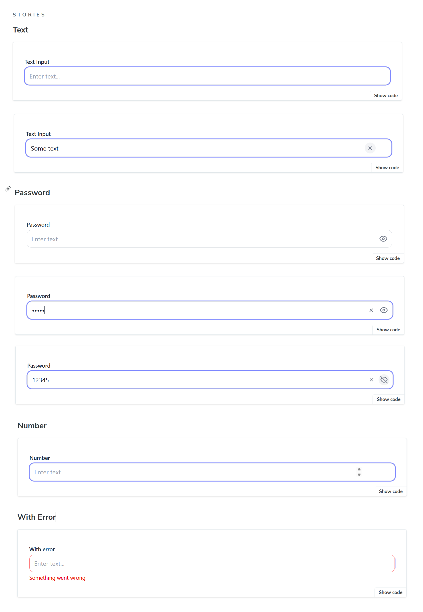
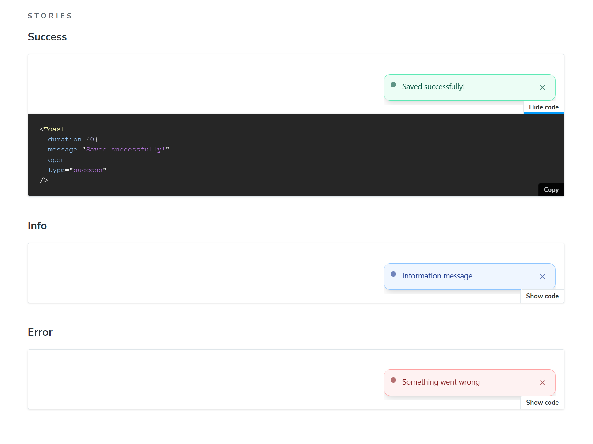
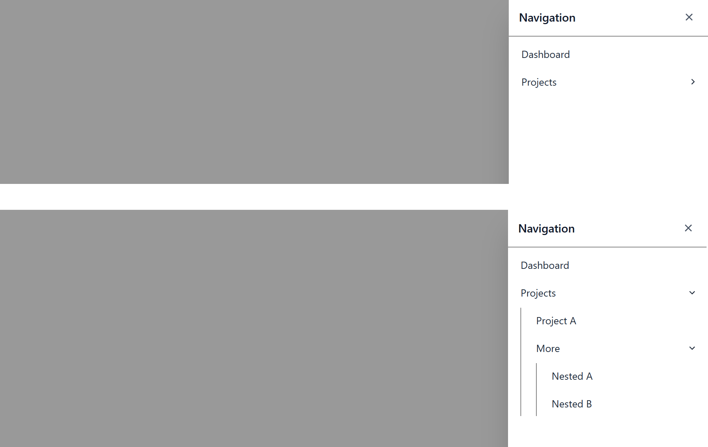

# 🧩 React Component Library — Storybook Demo

This project is a small **React component library** built with **Vite**, **TypeScript**, and **TailwindCSS**, visualized and documented using **Storybook**.  
The goal of the assignment was to implement three reusable UI components and display them with different states and props inside Storybook.

---

## 🚀 Tech Stack

- **React 19 + TypeScript**
- **Vite** — fast bundler and dev server
- **TailwindCSS** — styling
- **Storybook 9 (React + Vite)** — interactive documentation and component testing
- **ESLint + Prettier** — code formatting and linting

---

## 🧱 Implemented Components

### 🔹 Input
Smart input component supporting multiple types:
- `text`, `password`, `number`
- Clearable via “X” button
- Password visibility toggle
- Error message and label support  
- Fully styled with Tailwind

### 🔹 Toast
Notification component that appears in the bottom-right corner:
- Types: `success`, `info`, `warning`, `error`
- Auto-dismiss with configurable duration
- Smooth fade/slide transition
- Manual close button
- Reusable `<ToastViewport />` container for multiple toasts

### 🔹 SidebarMenu
Collapsible sidebar with nested menu items:
- Opens from the right side
- Supports multi-level nested lists
- Click outside or “Escape” closes menu
- Smooth slide and accordion animations

---

## Component Screenshots

| Component | Example |
|------------|----------|
| **Input** |  |
| **Toast (Success)** |  |
| **SidebarMenu** |  |

---

## 🧭 Storybook

Each component has its own stories showing variations of props and states.

Run Storybook locally:
```bash
npm run storybook